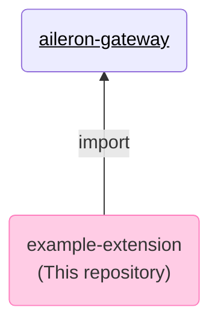

# Example project extending the [AILERON Gateway](https://github.com/aileron-gateway/aileron-gateway) <!-- omit in toc -->

This project extend the [AILERON Gateway](https://github.com/aileron-gateway/aileron-gateway) by importing it to Go project.



**To build and run the example, follow the steps.**

- [Prepare development environment](#prepare-development-environment)
  - [1. Install Protoc](#1-install-protoc)
  - [2. Install protoc-gen-go](#2-install-protoc-gen-go)
  - [3. protovalidate](#3-protovalidate)
- [Write code](#write-code)
- [Build binary](#build-binary)
  - [1. Generate Go code from proto](#1-generate-go-code-from-proto)
  - [2. Build binary](#2-build-binary)
- [Run binary](#run-binary)

## Prepare development environment

### 1. Install [Protoc](https://github.com/protocolbuffers/protobuf)

AILERON Gateway uses [protocol buffer](https://github.com/protocolbuffers/protobuf) to define configuration file interfaces.
`protoc` command is required to generate Go codes from `*.proto` definitions.

**Follow the [Protocol Buffer Compiler Installation](https://protobuf.dev/installation/) and install `protoc` command.**

```bash
$ protoc --version
libprotoc 29.0
```

If you are working on linux, directory structure may becomes like follows.

```txt
/usr/
└── local/
    ├── bin/
    │   └── protoc
    └── include/
        └── google/
```

### 2. Install [protoc-gen-go](https://pkg.go.dev/google.golang.org/protobuf)

To generate Go codes from protoc definitions, `protoc-gen-go` command is required.

**Follow the [Quick start Go](https://grpc.io/docs/languages/go/quickstart/) to install protoc-gen-go.**

Or, just run the following installation command.

```bash
go install "google.golang.org/protobuf/cmd/protoc-gen-go@latest"
```

### 3. [protovalidate](https://github.com/bufbuild/protovalidate)

AILERON Gateway uses [protovalidate](https://github.com/bufbuild/protovalidate) to apply configuration validation.
We need to import [validate.proto](https://github.com/bufbuild/protovalidate/blob/main/proto/protovalidate/buf/validate/validate.proto)

**In this project, validate.proto is already copied into the [./proto/buf/](./proto/buf/).**

## Write code

- Example middleware is in [./feature/hello/](./feature/hello/).
- Example protoc is in [./proto/ext/v1/](./proto/ext/v1/).

The example middleware adds `Hello: World!!` to the HTTP response headers.

## Build binary

### 1. Generate Go code from proto

`protoc` should be run to generate go codes from proto definition.

The command becomes

```bash
protoc \
  --proto_path ./proto
  --proto_path=<PATH_TO_AILERON_GATEWAY_REPOSITORY>/proto/
  --plugin=protoc-gen-go=<ABSOLUTE_PATH_TO protoc-gen-go>
  --go_out=./
  --go_opt=module="github.com/aileron-gateway/example-extension"
  <ALL_PROTOC_PATH>
```

For convenience, the command can be run with [./Makefile](./Makefile).

```bash
go get ./... # Download aileron-gateway repository.
make proto
```

### 2. Build binary

Just run `go build` to generate `example-extension` or `example-extension.exe`.

```bash
go build ./
```

Or, this is recommended one.

```bash
export CGO_ENABLED=0
go build -trimpath -ldflags="-w -s -extldflags '-static'" ./
```

## Run binary

[./config.yaml](./config.yaml) is a sample configuration.

It runs a reverse proxy server which proxy requests to [http://httpbin.org](http://httpbin.org).

Run the reverse proxy server with the command.

```sh
./example-extension -f config.yaml
```

Then, send a HTTP request.

```sh
curl --head -X GET "http://localhost:8080/get"
```

The `Hello: World!!` header which is added by the [./feature/hello/](./feature/hello/) exists in the header.

```text
HTTP/1.1 200 OK
Access-Control-Allow-Credentials: true
Access-Control-Allow-Origin: *
Content-Length: 309
Content-Type: application/json
Date: Sat, 26 Apr 2025 13:05:51 GMT
Hello: World!!
Server: gunicorn/19.9.0
```
